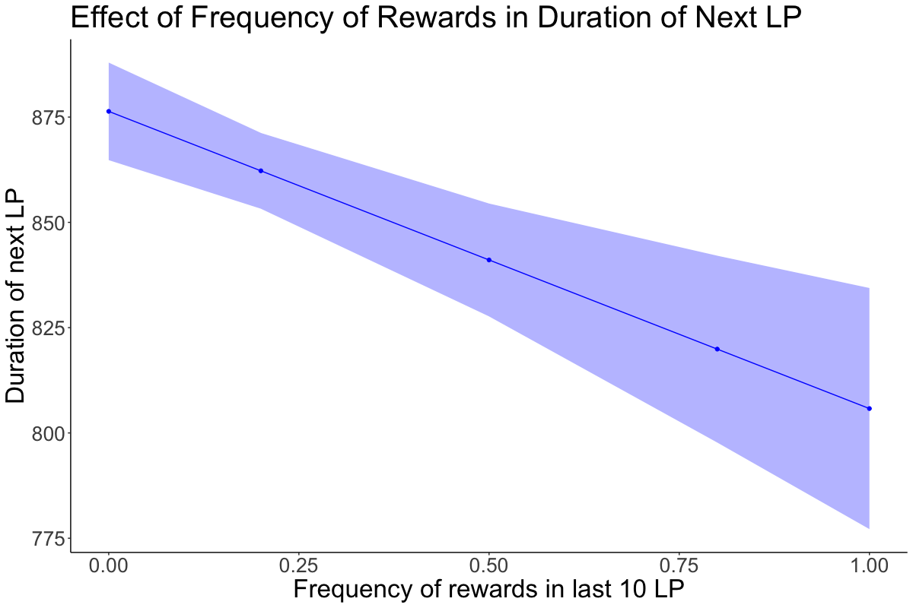
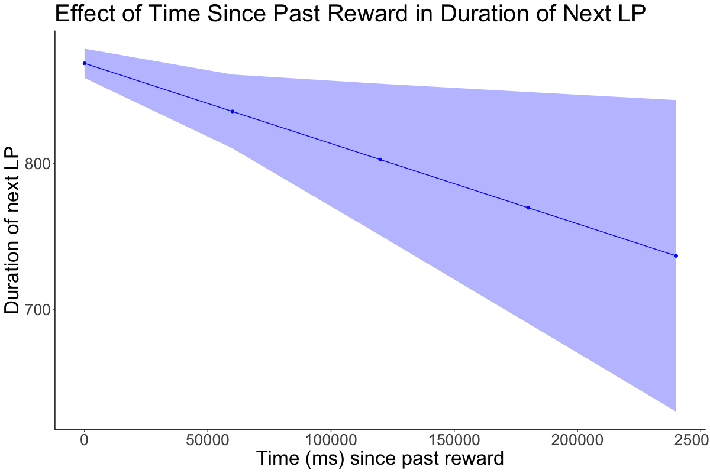

```{r setup, include=FALSE}
knitr::opts_chunk$set(tidy.opts = list(width.cutoff = 60), tidy = TRUE, echo = TRUE)

```

## Abstract

We hypothesize that a potential factor in the decreased utility of reward is the desensitization of the reward based on the density of the reward schedule. In other words, the mouse is less interested in reward if it has already received a reward recently. This study examines the predictive power of the density of successful previous lever presses on the duration of the next lever press. The data is sourced from (Schreiner et al., 2022) on mice foraging behavior. We first replicated the results using linear mixed-effects models conducted in the source paper. Then, we estimate two augmented models: i) adding the frequency of rewards in the last 10 lever presses, and ii) adding the time from the last reward until the lever press. Lastly, we conducted a model comparison analysis between the baseline and the augmented models. The baseline model indicated that previous lever presses at t-1 to t-6 have statistically significant predictive power. For the augmented model, we determine to take into account the 10 past lever presses given that in the baseline study, 10 events is the limit at which previous events begin to demonstrate a lack of significant interaction effect on the current event at t. The augmented models show, with statistical significance, that as the frequency of rewards in the past lever presses increases, the duration of the lever press tends to decrease. On the other hand, the time passed from the last reward has a negative significant effect on the next lever press duration. 

## Motivation

The article analyzes the continuous behavior of mice in a free-roam environment. Precisely, mice are placed into an operant box where if a lever is pressed for a certain threshold of duration (800ms) then the mouse is rewarded with sucrose or food pellets. Behavioral data is collected regarding the number of lever presses and the duration of each lever press. The article shows the ability of mice to increase the percentage of successful lever presses during a session and across sessions. Specifically, the authors found that the duration of the previous six lever presses has a statistically significant effect on the duration of the next lever press.

We make the prior assumption that the mice in the study are conditioned to associate lever presses with reward, then a shorter lever press indicates a decrease in utility of reward for reasons or combinations thereof including but not limited to: 1. over-stimulation of reward thus reducing the desirability of reward, 2. There are competing factors in the environment that distract the mice from the reward. 

## Research questions

Is frequency of reward strongly correlated with reward utility? Assuming that the mouse is a deterministic agent that will always choose the reward of a certain utility value, then there must be a change in the utility value of a reward if a mouse decides to participate in a competing behavior that does not result in a reward. Thus we ask the following questions: 

i) is the frequency of reward strongly correlated with a decrease in reward utility?
ii) is the time since the last reward correlated with a decrease in reward utility?

## Hypotheses

Given that we hypothesize that mice experience diminishing returns on the rewards, we believe that as the frequency of rewards increases the duration of lever press decreases. Furthermore, we hypothesize that as time since the last reward increases, the duration of the next lever press should increase.

## Methods

### Study type

Observational

### Independent variables

- Duration of past lever presses (from n-1 to n-6). [$n…n_{-6}$]
- Inter lever press intervals (n to n-1 and n to n-2). [$IPI_{-1}, IPI_{-2}$]
- Rolling mean of the duration of lever press from n-7 up to n-60. [$MA$]
- Binary label that checks if a head entry happened in between class lever press n and n-1. [$HE_{-1}$]
- Binary label that checks if past lever press was rewarded or not. [$R$]
- Time in ms where a lever press occurred. [$t$]
- Percentage of successful lever presses across the trial. [$\%MET$]
- Time passed since last reward. [$t\_R$]
- Frequency of rewards in the last ten lever presses. [$freq\_R_{-10}$]

### Dependent variables

The outcome variable of interest is the duration of the next lever press.

### Data preprocessing

The raw data contained information from the trial, the subject, the behavior performed, and the time between the behavior and the previous behavior. From that, we constructed the explanatory, fixed effects, and random effects variables used in the linear mixed effects model (compact model) described in the paper. To fit and augmented the model into the data, we constructed two additional variables: i. time from the current lever pressed and the immediate last reward, and ii. count of rewards from the past ten lever presses.   

We used different types of tools available in R to construct the variables mentioned above. We employed if-else statements to, for example, differentiate between successful and unsuccessful lever presses. Furthermore, to differentiate between days and subjects, the process of creating a new indicator required first grouping the data by these two variables. This approach let us be confident that we did not contaminate the variables across trials and subjects.

Fortunately, the data set used does not contain any missing data. Nonetheless, in the construction of variables such as the duration of the n-6 lever press and the rolling mean, the value at the beginning of the trials is undefined. These observations were not taken into account for the estimation of the models.

Because the density of the duration of lever presses is very skewed to the right, and to not interfere with the observation of the “pure” behavior of the mice, we decided not to delete nor modify any potential outliers in the data.

## Results

### Data visualizations



This plot shows the predicted value in duration of lever press for different frequencies of rewards. Furthermore, as the frequency of past rewards increases, the predicted duration of the next lever press decreases. This suggests that the mouse is less interested in getting a successful lever press, and thus a reward if it has already received many recent rewards. The fitted parameter in this model suggests that our hypothesis about diminishing returns on rewards was correct.



From the plot, we can observe that, as the time since the last reward increases, the duration of the next lever press decreases. This result shows evidence against our hypothesis that mice would perform better in a no-recent reward scenario. This opens a question about why the results suggest this behavior. One hypothesis is that mice need a recent reminder to be aware of the relationship between the desired behavior and reward.

### Statistical modeling

**Compact model**

$n = \beta_{0} + \beta_{n-1}n_{-1} + … + \beta_{n-6}n_{-6} + \beta_{MA}MA + \beta_{t}t + \beta_{\%MET}\%MET + \beta_{IPI-1}IPI_{-1} + \beta_{IPI-2}IPI_{-2} + \beta_{R}R_{-1} + \\ \beta_{HE}HE_{-1} + \beta_{t*n-1}t*n-1 + \beta_{\%MET*n-1}\%MET*n-1 + \beta_{IPI*n-1}IPI_{-1}*n-1 + \beta_{IPI*n-2}IPI_{-2}*n-2  + \\ \beta_{R*n-1}R_{-1}*n-1 + \beta_{HE*n-1}IHE_{-1}*n-1 + \beta_{t*MA}t*MA + \beta_{\%MET*MA}\%MET*MA + \\ \beta_{IPI*MA}IPI_{-1}*MA + \beta_{Rew*MA}Rew_{-1}*MA + \beta_{HE*MA}HE_{-1}*MA + (1|M) + (1|D) + \varepsilon_{i}$

**Augmented model 1**

$n = \beta_{0} + \beta_{n-1}n_{-1} + … + \beta_{n-6}n_{-6} + \beta_{MA}MA + \beta_{t}t + \beta_{\%MET}\%MET + \beta_{IPI-1}IPI_{-1} + \beta_{IPI-2}IPI_{-2} + \beta_{R}R_{-1} + \\ \beta_{HE}HE_{-1} + \beta_{t*n-1}t*n-1 + \beta_{\%MET*n-1}\%MET*n-1 + \beta_{IPI*n-1}IPI_{-1}*n-1 + \beta_{IPI*n-2}IPI_{-2}*n-2  + \\ \beta_{R*n-1}R_{-1}*n-1 + \beta_{HE*n-1}IHE_{-1}*n-1 + \beta_{t*MA}t*MA + \beta_{\%MET*MA}\%MET*MA + \beta_{IPI*MA}IPI_{-1}*MA + \\ \beta_{R*MA}R_{-1}*MA + \beta_{HE*MA}HE_{-1}*MA + \beta_{freq\_R}freq\_R_{-10}  + (1|M) + (1|D) + \varepsilon_{i}$

**Augmented model 2**

$n = \beta_{0} + \beta_{n-1}n_{-1} + … + \beta_{n-6}n_{-6} + \beta_{MA}MA + \beta_{t}t + \beta_{\%MET}\%MET + \beta_{IPI-1}IPI_{-1} + \beta_{IPI-2}IPI_{-2} + \beta_{R}R_{-1} + \\ \beta_{HE}HE_{-1} + \beta_{t*n-1}t*n-1 + \beta_{\%MET*n-1}\%MET*n-1 + \beta_{IPI*n-1}IPI_{-1}*n-1 + \beta_{IPI*n-2}IPI_{-2}*n-2  + \\ \beta_{R*n-1}R_{-1}*n-1 + \beta_{HE*n-1}IHE_{-1}*n-1 + \beta_{t*MA}t*MA + \beta_{\%MET*MA}\%MET*MA + \beta_{IPI*MA}IPI_{-1}*MA + \\ \beta_{R*MA}R_{-1}*MA + \beta_{HE*MA}HE_{-1}*MA + \beta_{t\_rew}t\_R +(1|M) + (1|D) + \varepsilon_{i}$

### Summary of findings

The first augmented model shows that there is a significant relationship between the frequency of rewards in the last ten lever presses and the duration of the next lever press, controlling for every variable present in the compact model Chi(1, 29) = 16.12, p < 0.001. Thus, an increase of 1 percentage point in the frequency of rewards in the last ten lever presses is predicted to decrease the duration of the next lever press by 70 milliseconds [-100.5, -30.6] (95% confidence intervals), holding every other variable fixed.

For the second augmented model, the fitting of the data presents a significant negative relationship between the time passed since the last reward and the duration of the next lever press. Controlling for every variable from the compact model Chi(1, 29) = 5.43, p < 0.05. Holding everything else fixed, the model predicts that an increase of 1 second in the time passed since the last reward will decrease the duration of the next lever press by only 0.5 seconds  [-0.02, 0.02] (95% confidence intervals).

## Discussion

The results of this study inform how the way that an agent interacts with the environment affects the way that an agent interacts with the environment in the future with elements of the environment remaining static. Specifically, the agent experiences decreased reward utility as the rate of reward increases thus decreasing reward-seeking behavior in the future. On the other hand, the results also suggest that time also plays a role in this behavior. These two results further indirectly inform how the internal state of an agent changes with respect to the behavior-response feedback loop. In other words, this indicates that the action of a mouse and the associated reward state alters how the mouse perceives and judges its environment. Note that the assumption that lever press success rate and duration as indicators of reward utility, though not immediately problematic, is not well studied and thus is an area for further validation.

Being conscious of the high number of explanatory and control variables that are included in the base model, and the problems that this might stimulate (E. g. multicollinearity), a sensible next step should be to leverage the LASSO method to do a feature selection process. By shrinking the regression coefficients, we would select every non-zero value to be used in a new reduced model. We then would compare the base model with the reduced model to examine if we have a major significant loss in likelihood. If not, we could re-test our hypothesis with a new base model.

## References
Schreiner, D.C., Cazares, C., Renteria, R. et al. Information normally considered task-irrelevant drives decision-making and affects premotor circuit recruitment. Nat Commun 13, 2134 (2022). https://doi.org/10.1038/s41467-022-29807-2